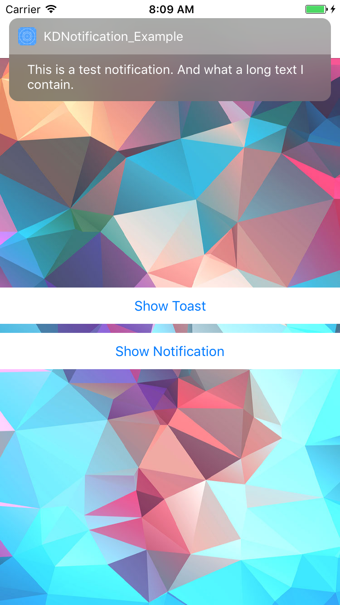
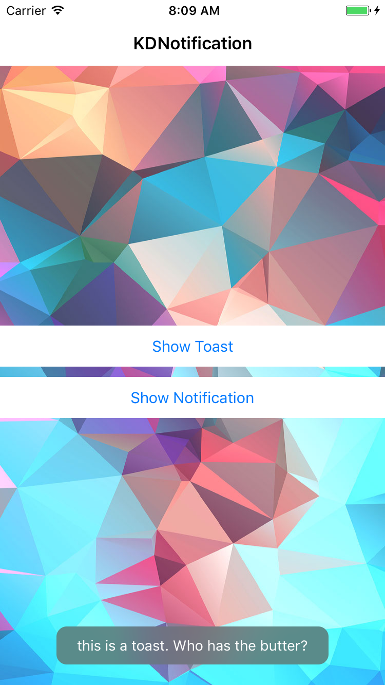

# KDNotification

[](http://cocoapods.org/pods/KDNotification)
[](http://cocoapods.org/pods/KDNotification)
[](http://cocoapods.org/pods/KDNotification)

KDNotification is a lightweight framework to show and interact with notifications and toast in your application. The general style is inspired by iOS 10 notifications.

##Screenshots
| Notification	| Toast	|
|:-------------:|:-------------:|:-------------:|
|  |  |
|  |  |
## Usage
 
#####Notifications:

```ruby
    [KDNotification showWithText:@"PING" duration:3.0 tapped:^ {
        NSLog(@"tapped notification");
    }];
```
#####Toasts:

```ruby
    [KDToastNotification showWithText:@"this is a toast. Who has the butter?" duration:3.0 tapped:^ {
        NSLog(@"tapped toast");
    }];
    
```

####Set Dark style:
```ruby
    [KDNotification setNotificionStyle:UIBlurEffectStyleDark];
```

## Example

To run the example project, clone the repo, and run `pod install` from the Example directory first.


## Installation

KDNotification is available through [CocoaPods](http://cocoapods.org). To install
it, simply add the following line to your Podfile:

```ruby
pod "KDNotification"
```
## TODO
* customization options (text color, font etc.)
* Actions

## Author

Kéké Dandois
Twitter: @kekedandois

## License

KDNotification is available under the MIT license. See the LICENSE file for more info.
